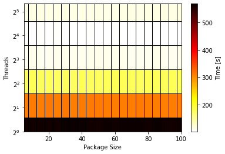
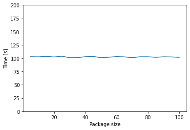
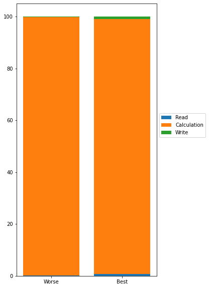
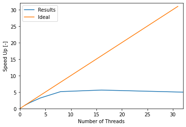

# Performance Analysis of OpenMP with Cantera

---

>"**report_time.csv**" file contains the execution time for different values of *Threads* and *Package sizes*.


```python
import pandas as pd

df = pd.read_csv("report_time.csv")
df["total_time[s]"] = df["read_time[s]"] + df["calc_time[s]"] + df["write_time[s]"]
df
```


<div>
<style scoped>
    .dataframe tbody tr th:only-of-type {
        vertical-align: middle;
    }

    .dataframe tbody tr th {
        vertical-align: top;
    }

    .dataframe thead th {
        text-align: right;
    }
</style>
<table border="1" class="dataframe">
  <thead>
    <tr style="text-align: right;">
      <th></th>
      <th>threads</th>
      <th>package</th>
      <th>points</th>
      <th>read_time[s]</th>
      <th>calc_time[s]</th>
      <th>write_time[s]</th>
      <th>total_time[s]</th>
    </tr>
  </thead>
  <tbody>
    <tr>
      <th>0</th>
      <td>1</td>
      <td>5</td>
      <td>55076</td>
      <td>0.670609</td>
      <td>563.370</td>
      <td>0.949715</td>
      <td>564.990324</td>
    </tr>
    <tr>
      <th>1</th>
      <td>1</td>
      <td>10</td>
      <td>55076</td>
      <td>0.653276</td>
      <td>563.092</td>
      <td>0.944177</td>
      <td>564.689453</td>
    </tr>
    <tr>
      <th>2</th>
      <td>1</td>
      <td>15</td>
      <td>55076</td>
      <td>0.655501</td>
      <td>562.006</td>
      <td>0.941386</td>
      <td>563.602887</td>
    </tr>
    <tr>
      <th>3</th>
      <td>1</td>
      <td>20</td>
      <td>55076</td>
      <td>0.648578</td>
      <td>561.914</td>
      <td>0.945217</td>
      <td>563.507795</td>
    </tr>
    <tr>
      <th>4</th>
      <td>1</td>
      <td>25</td>
      <td>55076</td>
      <td>0.645982</td>
      <td>561.662</td>
      <td>0.949270</td>
      <td>563.257252</td>
    </tr>
    <tr>
      <th>...</th>
      <td>...</td>
      <td>...</td>
      <td>...</td>
      <td>...</td>
      <td>...</td>
      <td>...</td>
      <td>...</td>
    </tr>
    <tr>
      <th>115</th>
      <td>32</td>
      <td>80</td>
      <td>55076</td>
      <td>0.649529</td>
      <td>112.754</td>
      <td>0.948711</td>
      <td>114.352240</td>
    </tr>
    <tr>
      <th>116</th>
      <td>32</td>
      <td>85</td>
      <td>55076</td>
      <td>0.646358</td>
      <td>113.022</td>
      <td>0.955529</td>
      <td>114.623887</td>
    </tr>
    <tr>
      <th>117</th>
      <td>32</td>
      <td>90</td>
      <td>55076</td>
      <td>0.651376</td>
      <td>112.456</td>
      <td>0.943477</td>
      <td>114.050853</td>
    </tr>
    <tr>
      <th>118</th>
      <td>32</td>
      <td>95</td>
      <td>55076</td>
      <td>0.646021</td>
      <td>112.975</td>
      <td>0.948980</td>
      <td>114.570001</td>
    </tr>
    <tr>
      <th>119</th>
      <td>32</td>
      <td>100</td>
      <td>55076</td>
      <td>0.651154</td>
      <td>112.316</td>
      <td>0.944377</td>
      <td>113.911531</td>
    </tr>
  </tbody>
</table>
<p>120 rows × 7 columns</p>
</div>


---

>Next processing generate a *mesh grid*. The goal is visualize execution time for different *threads* and *package sizes* at the same time.


```python
import numpy as np

threads=np.array([1,2,4,8,16,32])
packages=np.array(range(5,105,5))

m = threads.size
n = packages.size

time_mat = np.zeros([m,n])


for i in range(m):
    t = threads[i]
    for j in range(n):
        pack = packages[j]
        time_mat[i,j] = df[(df["threads"]==t) & (df["package"]==pack)].iloc[0,6]

x, y = np.meshgrid(packages,threads)

print(time_mat)
```

    [[564.990324 564.689453 563.602887 563.507795 563.257252 567.348884
      566.679903 565.972371 563.931938 562.586902 566.696799 565.120384
      566.297586 565.352592 566.064123 563.506679 568.966247 563.699327
      562.182807 565.572136]
     [310.781935 312.286921 310.942884 314.001813 309.904486 315.885435
      310.697373 311.34645  312.806553 312.644245 309.498782 310.628921
      310.312532 310.606181 311.283371 309.756419 309.978529 309.334745
      310.613386 310.616055]
     [177.694928 179.65331  178.114928 178.410672 177.247289 177.318414
      177.675206 179.772135 176.881424 177.412945 177.849963 179.69739
      180.484016 178.593561 177.703517 179.797351 178.962587 179.104136
      180.261011 177.892061]
     [108.743866 110.339188 108.773748 108.979997 111.140969 111.190473
      110.213269 110.883652 110.291674 110.194257 111.488159 110.291318
      110.301376 109.961194 109.866208 109.491962 110.753118 109.940782
      109.655176 111.322677]
     [102.923969 102.616974 103.515912 102.353564 103.790989 101.009741
      101.157668 102.837197 103.411012 101.026034 101.892342 103.107268
      102.531891 101.076304 102.748739 102.722021 101.782058 102.664765
      102.424702 101.730117]
     [112.998871 114.417457 113.871023 115.084879 114.965864 114.194135
      114.766139 114.970155 113.775079 113.862571 112.826607 113.401955
      115.475681 114.516111 113.231871 114.35224  114.623887 114.050853
      114.570001 113.911531]]


---

## Heat map visualization

>Results indicate that *package* size has no influence in performance. In addition, best performance is obtained with 16 threads instead of 32 (16 real processors and 32 logical in the machine where the program run).


```python
import matplotlib.pyplot as plt

fig, ax = plt.subplots()

heat_map = ax.pcolormesh(x,y,time_mat, cmap="hot_r",edgecolors="black")

cbar = fig.colorbar(heat_map, ax=ax)
cbar.set_label("Time [s]")

#ax.set_ylim(1,32)
ax.set_ylim(1)
ax.set_xlim(5,100)
ax.set_xlabel("Package Size")
ax.set_ylabel("Threads")

ax.set_yscale("log",base=2)
#plt.yscale("log",base=2)

plt.show()
```


    

    


---

## Package size influence for 16 threads

>With this line chart we can confirm that, in the way this code is written, package size has no effect in performance


```python
sixteen = df[df["threads"]==16]

fig, ax = plt.subplots()

ax.plot(sixteen["package"], sixteen["total_time[s]"])

ax.set_ylim(0,200)
ax.set_xlabel("Package size")
ax.set_ylabel("Time [s]")

plt.show()
```


    

    


---

## Best execution time

>Analysis of the best performance execution


```python
best_conf = df[df["total_time[s]"] == df["total_time[s]"].min()]
best_conf
```


<div>
<style scoped>
    .dataframe tbody tr th:only-of-type {
        vertical-align: middle;
    }

    .dataframe tbody tr th {
        vertical-align: top;
    }

    .dataframe thead th {
        text-align: right;
    }
</style>
<table border="1" class="dataframe">
  <thead>
    <tr style="text-align: right;">
      <th></th>
      <th>threads</th>
      <th>package</th>
      <th>points</th>
      <th>read_time[s]</th>
      <th>calc_time[s]</th>
      <th>write_time[s]</th>
      <th>total_time[s]</th>
    </tr>
  </thead>
  <tbody>
    <tr>
      <th>85</th>
      <td>16</td>
      <td>30</td>
      <td>55076</td>
      <td>0.647573</td>
      <td>99.4128</td>
      <td>0.949368</td>
      <td>101.009741</td>
    </tr>
  </tbody>
</table>
</div>


```python
worse_conf = df[df["total_time[s]"] == df["total_time[s]"].max()]
worse_conf
```


<div>
<style scoped>
    .dataframe tbody tr th:only-of-type {
        vertical-align: middle;
    }

    .dataframe tbody tr th {
        vertical-align: top;
    }

    .dataframe thead th {
        text-align: right;
    }
</style>
<table border="1" class="dataframe">
  <thead>
    <tr style="text-align: right;">
      <th></th>
      <th>threads</th>
      <th>package</th>
      <th>points</th>
      <th>read_time[s]</th>
      <th>calc_time[s]</th>
      <th>write_time[s]</th>
      <th>total_time[s]</th>
    </tr>
  </thead>
  <tbody>
    <tr>
      <th>16</th>
      <td>1</td>
      <td>85</td>
      <td>55076</td>
      <td>0.645723</td>
      <td>567.374</td>
      <td>0.946524</td>
      <td>568.966247</td>
    </tr>
  </tbody>
</table>
</div>


```python
b_tot = best_conf["total_time[s]"].iloc[0]
b_read = best_conf["read_time[s]"].iloc[0]
b_calc = best_conf["calc_time[s]"].iloc[0]
b_write = best_conf["write_time[s]"].iloc[0]

w_tot = worse_conf["total_time[s]"].iloc[0]
w_read = worse_conf["read_time[s]"].iloc[0]
w_calc = worse_conf["calc_time[s]"].iloc[0]
w_write = worse_conf["write_time[s]"].iloc[0]

x = ["Worse", "Best"]

read_per = np.array([w_read/w_tot*100, b_read/b_tot*100])
calc_per = np.array([w_calc/w_tot*100, b_calc/b_tot*100])
write_per = np.array([w_write/w_tot*100, b_write/b_tot*100])
print(read_per)

fig, ax = plt.subplots()

fig.set_size_inches(5,10)

ax.bar(x, read_per, label="Read")
ax.bar(x, calc_per, bottom=read_per, label="Calculation")
ax.bar(x, write_per, bottom=read_per+calc_per, label="Write")
ax.legend(loc="lower left",bbox_to_anchor=(1.0,0.5))

plt.show()
```

    [0.11349056 0.64109955]


    

    


>Due to read and write executions are secuential, results times in both executions (*best* and *worse*) are similar (but relatively, *best*'s read and write times are greater than *worse*). Even so, both can be ignored comparing with calculation time.

---

## Speed up

> Results are worse than expected, the code has to be improved in order to gain better performance. Mesh points have no dependency on each other, so the parallelization should be almost ideal.


```python
serial_time = df[(df["threads"]==1) & (df["package"]==5)].iloc[0,6]
print("Serial Time: ", serial_time, "s")

df["speedup"] = serial_time / df["total_time[s]"]
df
```

    Serial Time:  564.990324 s


<div>
<style scoped>
    .dataframe tbody tr th:only-of-type {
        vertical-align: middle;
    }

    .dataframe tbody tr th {
        vertical-align: top;
    }

    .dataframe thead th {
        text-align: right;
    }
</style>
<table border="1" class="dataframe">
  <thead>
    <tr style="text-align: right;">
      <th></th>
      <th>threads</th>
      <th>package</th>
      <th>points</th>
      <th>read_time[s]</th>
      <th>calc_time[s]</th>
      <th>write_time[s]</th>
      <th>total_time[s]</th>
      <th>speedup</th>
    </tr>
  </thead>
  <tbody>
    <tr>
      <th>0</th>
      <td>1</td>
      <td>5</td>
      <td>55076</td>
      <td>0.670609</td>
      <td>563.370</td>
      <td>0.949715</td>
      <td>564.990324</td>
      <td>1.000000</td>
    </tr>
    <tr>
      <th>1</th>
      <td>1</td>
      <td>10</td>
      <td>55076</td>
      <td>0.653276</td>
      <td>563.092</td>
      <td>0.944177</td>
      <td>564.689453</td>
      <td>1.000533</td>
    </tr>
    <tr>
      <th>2</th>
      <td>1</td>
      <td>15</td>
      <td>55076</td>
      <td>0.655501</td>
      <td>562.006</td>
      <td>0.941386</td>
      <td>563.602887</td>
      <td>1.002462</td>
    </tr>
    <tr>
      <th>3</th>
      <td>1</td>
      <td>20</td>
      <td>55076</td>
      <td>0.648578</td>
      <td>561.914</td>
      <td>0.945217</td>
      <td>563.507795</td>
      <td>1.002631</td>
    </tr>
    <tr>
      <th>4</th>
      <td>1</td>
      <td>25</td>
      <td>55076</td>
      <td>0.645982</td>
      <td>561.662</td>
      <td>0.949270</td>
      <td>563.257252</td>
      <td>1.003077</td>
    </tr>
    <tr>
      <th>...</th>
      <td>...</td>
      <td>...</td>
      <td>...</td>
      <td>...</td>
      <td>...</td>
      <td>...</td>
      <td>...</td>
      <td>...</td>
    </tr>
    <tr>
      <th>115</th>
      <td>32</td>
      <td>80</td>
      <td>55076</td>
      <td>0.649529</td>
      <td>112.754</td>
      <td>0.948711</td>
      <td>114.352240</td>
      <td>4.940789</td>
    </tr>
    <tr>
      <th>116</th>
      <td>32</td>
      <td>85</td>
      <td>55076</td>
      <td>0.646358</td>
      <td>113.022</td>
      <td>0.955529</td>
      <td>114.623887</td>
      <td>4.929080</td>
    </tr>
    <tr>
      <th>117</th>
      <td>32</td>
      <td>90</td>
      <td>55076</td>
      <td>0.651376</td>
      <td>112.456</td>
      <td>0.943477</td>
      <td>114.050853</td>
      <td>4.953846</td>
    </tr>
    <tr>
      <th>118</th>
      <td>32</td>
      <td>95</td>
      <td>55076</td>
      <td>0.646021</td>
      <td>112.975</td>
      <td>0.948980</td>
      <td>114.570001</td>
      <td>4.931398</td>
    </tr>
    <tr>
      <th>119</th>
      <td>32</td>
      <td>100</td>
      <td>55076</td>
      <td>0.651154</td>
      <td>112.316</td>
      <td>0.944377</td>
      <td>113.911531</td>
      <td>4.959905</td>
    </tr>
  </tbody>
</table>
<p>120 rows × 8 columns</p>
</div>


```python
speedup_data = df[df["package"] == 50] # Package value does not matter

fig, ax = plt.subplots()

ax.plot(speedup_data["threads"], speedup_data["speedup"])

# Ideal parallelization
ax.plot(range(0,32), range(0,32))

ax.set_xlim(0,32)
ax.set_ylim(0,32)
ax.set_xlabel("Number of Threads")
ax.set_ylabel("Speed Up [-]")
ax.legend(["Results", "Ideal"])

plt.show()
```


    

    

