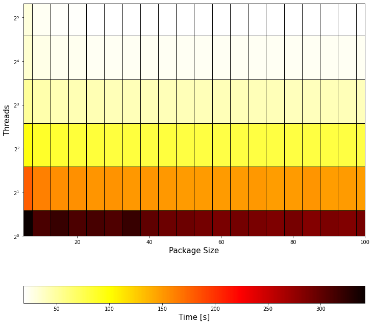
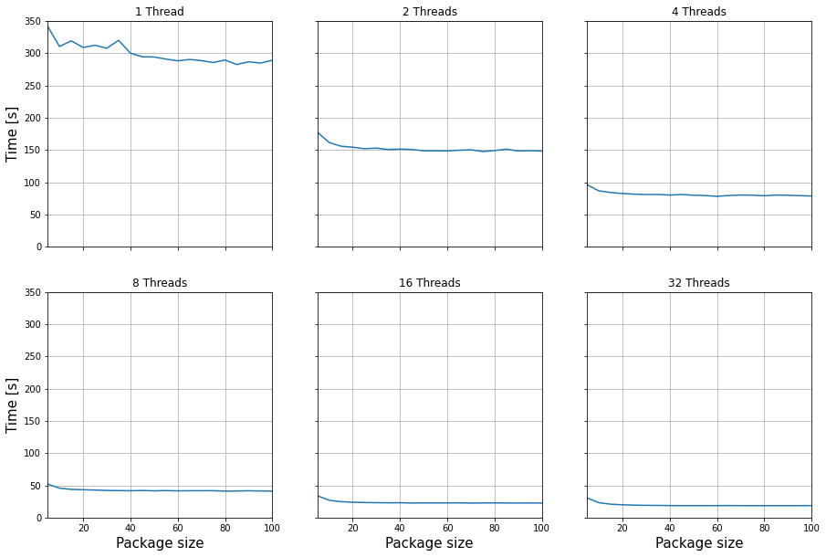
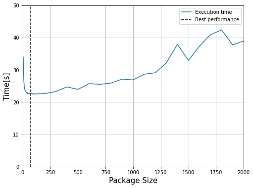
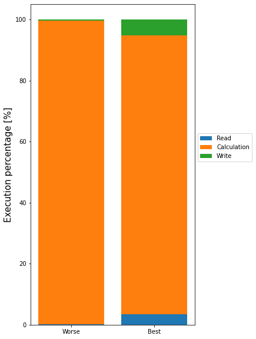
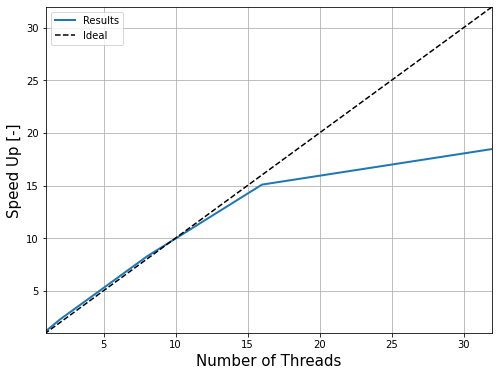
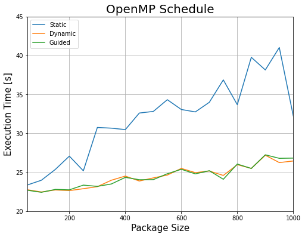

# Performance Analysis of OpenMP with Cantera

---

>"**report_time.csv**" file contains the execution time for different values of *Threads* and *Package sizes*.


```python
%matplotlib inline
```


```python
import pandas as pd

df = pd.read_csv("report_time_good_allocation.csv")
df["total_time[s]"] = df["read_time[s]"] + df["calc_time[s]"] + df["write_time[s]"]
df
```


<div>
<style scoped>
    .dataframe tbody tr th:only-of-type {
        vertical-align: middle;
    }

    .dataframe tbody tr th {
        vertical-align: top;
    }

    .dataframe thead th {
        text-align: right;
    }
</style>
<table border="1" class="dataframe">
  <thead>
    <tr style="text-align: right;">
      <th></th>
      <th>threads</th>
      <th>package</th>
      <th>points</th>
      <th>read_time[s]</th>
      <th>calc_time[s]</th>
      <th>write_time[s]</th>
      <th>total_time[s]</th>
    </tr>
  </thead>
  <tbody>
    <tr>
      <th>0</th>
      <td>1</td>
      <td>5</td>
      <td>55076</td>
      <td>0.670775</td>
      <td>340.4030</td>
      <td>0.944892</td>
      <td>342.018667</td>
    </tr>
    <tr>
      <th>1</th>
      <td>1</td>
      <td>10</td>
      <td>55076</td>
      <td>0.655164</td>
      <td>309.1560</td>
      <td>0.939349</td>
      <td>310.750513</td>
    </tr>
    <tr>
      <th>2</th>
      <td>1</td>
      <td>15</td>
      <td>55076</td>
      <td>0.651839</td>
      <td>317.8310</td>
      <td>0.947619</td>
      <td>319.430458</td>
    </tr>
    <tr>
      <th>3</th>
      <td>1</td>
      <td>20</td>
      <td>55076</td>
      <td>0.649019</td>
      <td>307.5440</td>
      <td>1.066140</td>
      <td>309.259159</td>
    </tr>
    <tr>
      <th>4</th>
      <td>1</td>
      <td>25</td>
      <td>55076</td>
      <td>0.737708</td>
      <td>311.0030</td>
      <td>0.944403</td>
      <td>312.685111</td>
    </tr>
    <tr>
      <th>...</th>
      <td>...</td>
      <td>...</td>
      <td>...</td>
      <td>...</td>
      <td>...</td>
      <td>...</td>
      <td>...</td>
    </tr>
    <tr>
      <th>115</th>
      <td>32</td>
      <td>80</td>
      <td>55076</td>
      <td>0.652154</td>
      <td>16.8526</td>
      <td>0.946403</td>
      <td>18.451157</td>
    </tr>
    <tr>
      <th>116</th>
      <td>32</td>
      <td>85</td>
      <td>55076</td>
      <td>0.651891</td>
      <td>16.8718</td>
      <td>0.945319</td>
      <td>18.469010</td>
    </tr>
    <tr>
      <th>117</th>
      <td>32</td>
      <td>90</td>
      <td>55076</td>
      <td>0.652476</td>
      <td>16.8783</td>
      <td>0.946065</td>
      <td>18.476841</td>
    </tr>
    <tr>
      <th>118</th>
      <td>32</td>
      <td>95</td>
      <td>55076</td>
      <td>0.647236</td>
      <td>16.9205</td>
      <td>0.948532</td>
      <td>18.516268</td>
    </tr>
    <tr>
      <th>119</th>
      <td>32</td>
      <td>100</td>
      <td>55076</td>
      <td>0.651357</td>
      <td>16.9972</td>
      <td>0.944886</td>
      <td>18.593443</td>
    </tr>
  </tbody>
</table>
<p>120 rows × 7 columns</p>
</div>


---

>Next processing generate a *mesh grid*. The goal is visualize execution time for different *threads* and *package sizes* at the same time.


```python
import numpy as np

threads=np.array([1,2,4,8,16,32])
packages=np.array(range(5,105,5))

m = threads.size
n = packages.size

time_mat = np.zeros([m,n])


for i in range(m):
    t = threads[i]
    for j in range(n):
        pack = packages[j]
        time_mat[i,j] = df[(df["threads"]==t) & (df["package"]==pack)].iloc[0,6]

x, y = np.meshgrid(packages,threads)

print(time_mat)
```

    [[342.018667 310.750513 319.430458 309.259159 312.685111 307.970375
      320.337647 300.429719 294.781766 294.431    291.238474 288.507805
      290.646049 288.832833 285.876271 289.73807  282.806401 287.003398
      284.990935 289.384872]
     [177.987334 161.842158 156.073627 154.506865 152.188535 153.075609
      150.988468 151.586574 150.98333  148.897506 148.880773 148.770816
      149.81849  150.46284  147.8117   149.267168 151.46977  148.600765
      149.124795 148.560151]
     [ 96.499961  86.857529  84.231629  82.742628  81.700536  81.117573
       81.18899   80.277892  81.172854  80.051088  79.486654  78.286172
       79.545739  80.334172  80.099616  79.203883  80.292072  79.975926
       79.341339  78.814435]
     [ 51.970453  45.585781  43.70107   43.132581  42.69123   42.073699
       41.809946  41.562801  41.944678  41.470763  41.836192  41.40679
       41.616486  41.615327  41.676494  41.014733  41.174769  41.526362
       41.238668  41.038621]
     [ 33.941628  26.825051  24.611803  23.74634   23.332992  23.101835
       22.879539  22.992271  22.545785  22.67496   22.656839  22.692696
       22.781705  22.460669  22.628766  22.668798  22.607915  22.484004
       22.632186  22.477539]
     [ 30.520486  23.091992  20.778826  19.81287   19.287875  18.941626
       18.832002  18.589837  18.529733  18.517695  18.525887  18.481651
       18.638244  18.502346  18.483492  18.451157  18.46901   18.476841
       18.516268  18.593443]]


---

## Heat map visualization


```python
import matplotlib.pyplot as plt

fig, ax = plt.subplots(figsize=(12,12))

heat_map = ax.pcolormesh(x,y,time_mat, cmap="hot_r",edgecolors="black")

cbar = fig.colorbar(heat_map, ax=ax, orientation = 'horizontal')
cbar.set_label("Time [s]",fontsize=15)

#ax.set_ylim(1,32)
ax.set_ylim(1)
ax.set_xlim(5,100)
ax.set_xlabel("Package Size",fontsize=15)
ax.set_ylabel("Threads",fontsize=15)

ax.set_yscale("log",base=2)
#plt.yscale("log",base=2)

plt.show()
```


    

    


---

## Package size influence for different threads

> It can be appreciated that there is a small range of improvement between package size of 5 until 20, after that range package size has no effect in performance.


```python
one = df[df["threads"]==1]
two = df[df["threads"]==2]
four = df[df["threads"]==4]
eight = df[df["threads"]==8]
sixteen = df[df["threads"]==16]
thirtytwo = df[df["threads"]==32]

fig, ((ax1,ax2,ax3),(ax4,ax5,ax6)) = plt.subplots(nrows=2,ncols=3, sharex=True,sharey=True, figsize=(15,10))

ax1.plot(one["package"], one["total_time[s]"])
ax2.plot(two["package"], two["total_time[s]"])
ax3.plot(four["package"], four["total_time[s]"])
ax4.plot(eight["package"], eight["total_time[s]"])
ax5.plot(sixteen["package"], sixteen["total_time[s]"])
ax6.plot(thirtytwo["package"], thirtytwo["total_time[s]"])

ax1.set_title('1 Thread')
ax2.set_title('2 Threads')
ax3.set_title('4 Threads')
ax4.set_title('8 Threads')
ax5.set_title('16 Threads')
ax6.set_title('32 Threads')

ax1.set_ylim(0,350)
ax1.set_xlim(5,100)
ax4.set_xlabel("Package size",fontsize = 15)
ax5.set_xlabel("Package size",fontsize = 15)
ax6.set_xlabel("Package size",fontsize = 15)
ax1.set_ylabel("Time [s]",fontsize = 15)
ax4.set_ylabel("Time [s]",fontsize = 15)


ax1.grid()
ax2.grid()
ax3.grid()
ax4.grid()
ax5.grid()
ax6.grid()

plt.show()
```


    

    


---

## Another analysis of the package influence in performance

> This time 16 only threads were tested.


```python
# Concatenate new results (package size [100, 2000]) with the old ones
df2 = pd.read_csv("package_results_16_threads.csv")
df2["total_time[s]"] = df2["read_time[s]"] + df2["calc_time[s]"] + df2["write_time[s]"]
sixteenPackages = pd.concat([sixteen, df2], ignore_index=True)

fig, ax = plt.subplots(figsize=(8,6))
ax.plot(sixteenPackages["package"], sixteenPackages["total_time[s]"])

ax.set_xlabel("Package Size", fontsize=15)
ax.set_ylabel("Time[s]", fontsize=15)
ax.set_ylim(0,50)
ax.set_xlim(0,2000)
ax.grid()


# Find the minimun execution time

best = sixteenPackages[sixteenPackages["total_time[s]"] == sixteenPackages["total_time[s]"].min()]
best_package = int(best["package"])
best_time = float(best["total_time[s]"])

print("Package size with best performance: ", best_package)
print("\nTotal time execution: ", best_time, "seconds")
ax.plot(np.ones(51,dtype=int)*best_package, range(0,51),'--', color='black')

plt.legend(['Execution time','Best performance'])

plt.show()
```

    Package size with best performance:  70
    
    Total time execution:  22.460669 seconds


    

    


---

## Best execution time

>Analysis of the best performance execution


```python
best_conf = df[df["total_time[s]"] == df["total_time[s]"].min()]
best_conf
```


<div>
<style scoped>
    .dataframe tbody tr th:only-of-type {
        vertical-align: middle;
    }

    .dataframe tbody tr th {
        vertical-align: top;
    }

    .dataframe thead th {
        text-align: right;
    }
</style>
<table border="1" class="dataframe">
  <thead>
    <tr style="text-align: right;">
      <th></th>
      <th>threads</th>
      <th>package</th>
      <th>points</th>
      <th>read_time[s]</th>
      <th>calc_time[s]</th>
      <th>write_time[s]</th>
      <th>total_time[s]</th>
    </tr>
  </thead>
  <tbody>
    <tr>
      <th>115</th>
      <td>32</td>
      <td>80</td>
      <td>55076</td>
      <td>0.652154</td>
      <td>16.8526</td>
      <td>0.946403</td>
      <td>18.451157</td>
    </tr>
  </tbody>
</table>
</div>


```python
worse_conf = df[df["total_time[s]"] == df["total_time[s]"].max()]
worse_conf
```


<div>
<style scoped>
    .dataframe tbody tr th:only-of-type {
        vertical-align: middle;
    }

    .dataframe tbody tr th {
        vertical-align: top;
    }

    .dataframe thead th {
        text-align: right;
    }
</style>
<table border="1" class="dataframe">
  <thead>
    <tr style="text-align: right;">
      <th></th>
      <th>threads</th>
      <th>package</th>
      <th>points</th>
      <th>read_time[s]</th>
      <th>calc_time[s]</th>
      <th>write_time[s]</th>
      <th>total_time[s]</th>
    </tr>
  </thead>
  <tbody>
    <tr>
      <th>0</th>
      <td>1</td>
      <td>5</td>
      <td>55076</td>
      <td>0.670775</td>
      <td>340.403</td>
      <td>0.944892</td>
      <td>342.018667</td>
    </tr>
  </tbody>
</table>
</div>


```python
b_tot = best_conf["total_time[s]"].iloc[0]
b_read = best_conf["read_time[s]"].iloc[0]
b_calc = best_conf["calc_time[s]"].iloc[0]
b_write = best_conf["write_time[s]"].iloc[0]

w_tot = worse_conf["total_time[s]"].iloc[0]
w_read = worse_conf["read_time[s]"].iloc[0]
w_calc = worse_conf["calc_time[s]"].iloc[0]
w_write = worse_conf["write_time[s]"].iloc[0]

x = ["Worse", "Best"]

read_per = np.array([w_read/w_tot*100, b_read/b_tot*100])
calc_per = np.array([w_calc/w_tot*100, b_calc/b_tot*100])
write_per = np.array([w_write/w_tot*100, b_write/b_tot*100])

fig, ax = plt.subplots()

fig.set_size_inches(5,10)

ax.bar(x, read_per, label="Read")
ax.bar(x, calc_per, bottom=read_per, label="Calculation")
ax.bar(x, write_per, bottom=read_per+calc_per, label="Write")
ax.legend(loc="lower left",bbox_to_anchor=(1.0,0.5))
ax.set_ylabel('Execution percentage [%]',fontsize=15)

plt.show()
```


    

    


>Due to read and write executions are secuential, results times in both executions (*best* and *worse*) are similar (but relatively, *best*'s read and write times are greater than *worse*). Even so, both can be ignored comparing with calculation time.

---

## Speed up

> Keeping in mind that the machine, where the execution have been launch, has 16 real CPU cores, parallelization is almost perfect. Notice the lost of performance when 32 logic CPU are working concurrently (each core can manage 2 threads).


```python
serial_time = df[(df["threads"]==1) & (df["package"]==5)].iloc[0,6]
print("Serial Time: ", serial_time, "s")

df["speedup"] = serial_time / df["total_time[s]"]
df
```

    Serial Time:  342.018667 s


<div>
<style scoped>
    .dataframe tbody tr th:only-of-type {
        vertical-align: middle;
    }

    .dataframe tbody tr th {
        vertical-align: top;
    }

    .dataframe thead th {
        text-align: right;
    }
</style>
<table border="1" class="dataframe">
  <thead>
    <tr style="text-align: right;">
      <th></th>
      <th>threads</th>
      <th>package</th>
      <th>points</th>
      <th>read_time[s]</th>
      <th>calc_time[s]</th>
      <th>write_time[s]</th>
      <th>total_time[s]</th>
      <th>speedup</th>
    </tr>
  </thead>
  <tbody>
    <tr>
      <th>0</th>
      <td>1</td>
      <td>5</td>
      <td>55076</td>
      <td>0.670775</td>
      <td>340.4030</td>
      <td>0.944892</td>
      <td>342.018667</td>
      <td>1.000000</td>
    </tr>
    <tr>
      <th>1</th>
      <td>1</td>
      <td>10</td>
      <td>55076</td>
      <td>0.655164</td>
      <td>309.1560</td>
      <td>0.939349</td>
      <td>310.750513</td>
      <td>1.100621</td>
    </tr>
    <tr>
      <th>2</th>
      <td>1</td>
      <td>15</td>
      <td>55076</td>
      <td>0.651839</td>
      <td>317.8310</td>
      <td>0.947619</td>
      <td>319.430458</td>
      <td>1.070714</td>
    </tr>
    <tr>
      <th>3</th>
      <td>1</td>
      <td>20</td>
      <td>55076</td>
      <td>0.649019</td>
      <td>307.5440</td>
      <td>1.066140</td>
      <td>309.259159</td>
      <td>1.105929</td>
    </tr>
    <tr>
      <th>4</th>
      <td>1</td>
      <td>25</td>
      <td>55076</td>
      <td>0.737708</td>
      <td>311.0030</td>
      <td>0.944403</td>
      <td>312.685111</td>
      <td>1.093812</td>
    </tr>
    <tr>
      <th>...</th>
      <td>...</td>
      <td>...</td>
      <td>...</td>
      <td>...</td>
      <td>...</td>
      <td>...</td>
      <td>...</td>
      <td>...</td>
    </tr>
    <tr>
      <th>115</th>
      <td>32</td>
      <td>80</td>
      <td>55076</td>
      <td>0.652154</td>
      <td>16.8526</td>
      <td>0.946403</td>
      <td>18.451157</td>
      <td>18.536435</td>
    </tr>
    <tr>
      <th>116</th>
      <td>32</td>
      <td>85</td>
      <td>55076</td>
      <td>0.651891</td>
      <td>16.8718</td>
      <td>0.945319</td>
      <td>18.469010</td>
      <td>18.518517</td>
    </tr>
    <tr>
      <th>117</th>
      <td>32</td>
      <td>90</td>
      <td>55076</td>
      <td>0.652476</td>
      <td>16.8783</td>
      <td>0.946065</td>
      <td>18.476841</td>
      <td>18.510668</td>
    </tr>
    <tr>
      <th>118</th>
      <td>32</td>
      <td>95</td>
      <td>55076</td>
      <td>0.647236</td>
      <td>16.9205</td>
      <td>0.948532</td>
      <td>18.516268</td>
      <td>18.471253</td>
    </tr>
    <tr>
      <th>119</th>
      <td>32</td>
      <td>100</td>
      <td>55076</td>
      <td>0.651357</td>
      <td>16.9972</td>
      <td>0.944886</td>
      <td>18.593443</td>
      <td>18.394585</td>
    </tr>
  </tbody>
</table>
<p>120 rows × 8 columns</p>
</div>


```python
speedup_data = df[df["package"] == 50] # Package value does not matter

fig, ax = plt.subplots(figsize=(8,6))

ax.plot(speedup_data["threads"], speedup_data["speedup"], linewidth=2)

# Ideal parallelization
ax.plot(range(0,33), range(0,33),'--', color='black')

ax.set_xlim(1,32)
ax.set_ylim(1,32)
ax.set_xlabel("Number of Threads",fontsize=15)
ax.set_ylabel("Speed Up [-]",fontsize=15)
ax.grid()
ax.legend(["Results", "Ideal"])

plt.show()
```


    

    


---

## Bonus analysis - Schedule planning with 16 threads


```python
schedule_results = pd.read_csv("schedule_study.csv")
schedule_results["total_time[s]"] = schedule_results["read_time[s]"] + schedule_results["calc_time[s]"] + schedule_results["write_time[s]"]
schedule_results[schedule_results["package"] == 1000]
```


<div>
<style scoped>
    .dataframe tbody tr th:only-of-type {
        vertical-align: middle;
    }

    .dataframe tbody tr th {
        vertical-align: top;
    }

    .dataframe thead th {
        text-align: right;
    }
</style>
<table border="1" class="dataframe">
  <thead>
    <tr style="text-align: right;">
      <th></th>
      <th>threads</th>
      <th>package</th>
      <th>points</th>
      <th>read_time[s]</th>
      <th>calc_time[s]</th>
      <th>write_time[s]</th>
      <th>total_time[s]</th>
    </tr>
  </thead>
  <tbody>
    <tr>
      <th>19</th>
      <td>16</td>
      <td>1000</td>
      <td>55076</td>
      <td>0.654643</td>
      <td>30.6285</td>
      <td>0.942790</td>
      <td>32.225933</td>
    </tr>
    <tr>
      <th>39</th>
      <td>16</td>
      <td>1000</td>
      <td>55076</td>
      <td>0.649057</td>
      <td>24.8539</td>
      <td>0.944631</td>
      <td>26.447588</td>
    </tr>
    <tr>
      <th>59</th>
      <td>16</td>
      <td>1000</td>
      <td>55076</td>
      <td>0.654377</td>
      <td>25.2146</td>
      <td>0.950429</td>
      <td>26.819406</td>
    </tr>
  </tbody>
</table>
</div>


```python
static = schedule_results.iloc[0:20]
dynamic = schedule_results.iloc[20:40]
guided = schedule_results.iloc[40:60]
```


```python
fig, ax = plt.subplots(figsize=(8,6))

ax.plot(static["package"], static["total_time[s]"])
ax.plot(dynamic["package"], dynamic["total_time[s]"])
ax.plot(guided["package"], guided["total_time[s]"])

ax.set_title("OpenMP Schedule", fontsize = 20)
ax.set_xlabel("Package Size", fontsize = 15)
ax.set_ylabel("Execution Time [s]", fontsize = 15)
ax.set_xlim(50,1000)
ax.set_ylim(20,45)
ax.grid()
ax.legend(["Static", "Dynamic", "Guided"])

plt.show()
```


    

    


---

## Core fragment of C++ code where this results comes is:  
  


```C++
    /******************** CALCULATION **********************/

    /* Outer loop to deliver work to threads */
    #pragma omp parallel for schedule(dynamic)
    for (size_t i = 0; i < ext_it; i++){
        size_t thread_points;
        // Limit the pack_size to the last iteration
        // because the number of points to process is the remainder
        if (i == (ext_it - 1) && mod > 0)
            thread_points = mod;
        else
            thread_points = pack_size;

        /********* VECTORS ***********/
        // Allocation of the required memory for Cantera application

        // Vector of pointers for solutions, ThermoPhases and reactors
        std::vector<std::shared_ptr<Cantera::Solution>> solutions(thread_points,                                                                                         Cantera::newSolution(mechanism,phase,"None"));
        
        std::vector<std::shared_ptr<Cantera::ThermoPhase>> gases(thread_points);
        std::vector<Cantera::IdealGasConstPressureReactor> reactors(thread_points);
        std::vector<Cantera::ReactorNet> nets(thread_points);
        /****************************/
        

        /* Inner loop to integrate the chemical */
        for (size_t j = 0; j < thread_points; j++){
            // Index of the global point
            size_t index = i * pack_size + j;

            // Define initial Values of unknows (Corresponds to phi = 1.0, perfect fuel air mixture)
            gases[j] = solutions[j]->thermo();
            gases[j]->setState_TPY(mesh->temp[index], p, mesh->matSp[index].data());


            // Insert the reaction
            reactors[j].insert(solutions[j]);
            nets[j].addReactor(reactors[j]);

            // Integrate time step
            nets[j].advance(dt);    

            // Save solution
            mesh->temp[index] = reactors[j].temperature();
            gases[j]->getMassFractions(mesh->matSp[index].data());
            mesh->enthal[index] = gases[j]->enthalpy_mass();
        }
    }
    /************************************************************/
```
