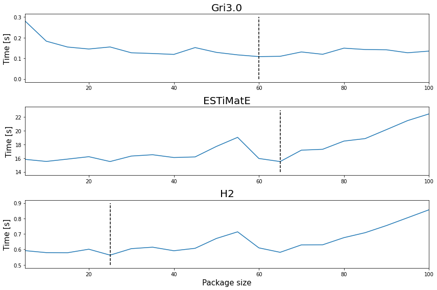
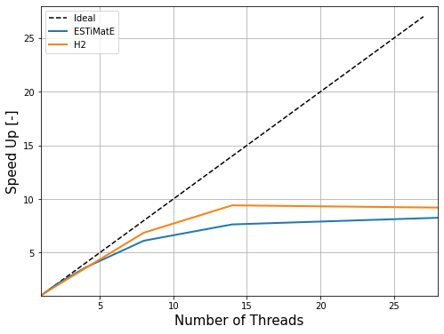

```python
import pandas as pd
import matplotlib.pyplot as plt
import numpy as np

df = pd.read_csv("package_report.csv")

gri = df[df["mechanism"] == "gri30.yaml"]
estimate = df[df["mechanism"] == "mechanism/ESTiMatE-Mech_04042022.xml"]
h2 = df[df["mechanism"] == "mechanism/h2_li_2004.xml"]


min_gri = gri["calc_time[s]"].min()
opt_gri = gri[gri["calc_time[s]"] == min_gri]
min_pack_gri = opt_gri["package"]
print("Optimal package size for gri3.0 mechanisms: {}".format(min_pack_gri.values[0]))
opt_gri
```

    Optimal package size for gri3.0 mechanisms: 60


<div>
<style scoped>
    .dataframe tbody tr th:only-of-type {
        vertical-align: middle;
    }

    .dataframe tbody tr th {
        vertical-align: top;
    }

    .dataframe thead th {
        text-align: right;
    }
</style>
<table border="1" class="dataframe">
  <thead>
    <tr style="text-align: right;">
      <th></th>
      <th>mechanism</th>
      <th>threads</th>
      <th>package</th>
      <th>points</th>
      <th>read_time[s]</th>
      <th>calc_time[s]</th>
      <th>write_time[s]</th>
    </tr>
  </thead>
  <tbody>
    <tr>
      <th>11</th>
      <td>gri30.yaml</td>
      <td>4</td>
      <td>60</td>
      <td>500</td>
      <td>0.006146</td>
      <td>0.108347</td>
      <td>0.009438</td>
    </tr>
  </tbody>
</table>
</div>


```python
min_est = estimate["calc_time[s]"].min()
opt_est = estimate[estimate["calc_time[s]"] == min_est]
min_pack_est = opt_est["package"]
print("Optimal package size for ESTiMatE mechanisms: {}".format(min_pack_est.values[0]))
opt_est
```

    Optimal package size for ESTiMatE mechanisms: 65


<div>
<style scoped>
    .dataframe tbody tr th:only-of-type {
        vertical-align: middle;
    }

    .dataframe tbody tr th {
        vertical-align: top;
    }

    .dataframe thead th {
        text-align: right;
    }
</style>
<table border="1" class="dataframe">
  <thead>
    <tr style="text-align: right;">
      <th></th>
      <th>mechanism</th>
      <th>threads</th>
      <th>package</th>
      <th>points</th>
      <th>read_time[s]</th>
      <th>calc_time[s]</th>
      <th>write_time[s]</th>
    </tr>
  </thead>
  <tbody>
    <tr>
      <th>32</th>
      <td>mechanism/ESTiMatE-Mech_04042022.xml</td>
      <td>4</td>
      <td>65</td>
      <td>500</td>
      <td>0.009554</td>
      <td>15.5032</td>
      <td>0.052151</td>
    </tr>
  </tbody>
</table>
</div>


```python
min_h2 = h2["calc_time[s]"].min()
opt_h2 = h2[h2["calc_time[s]"] == min_h2]
min_pack_h2 = opt_h2["package"]
print("Optimal package size for H2 mechanisms: {}".format(min_pack_h2.values[0]))
opt_h2
```

    Optimal package size for H2 mechanisms: 25


<div>
<style scoped>
    .dataframe tbody tr th:only-of-type {
        vertical-align: middle;
    }

    .dataframe tbody tr th {
        vertical-align: top;
    }

    .dataframe thead th {
        text-align: right;
    }
</style>
<table border="1" class="dataframe">
  <thead>
    <tr style="text-align: right;">
      <th></th>
      <th>mechanism</th>
      <th>threads</th>
      <th>package</th>
      <th>points</th>
      <th>read_time[s]</th>
      <th>calc_time[s]</th>
      <th>write_time[s]</th>
    </tr>
  </thead>
  <tbody>
    <tr>
      <th>44</th>
      <td>mechanism/h2_li_2004.xml</td>
      <td>4</td>
      <td>25</td>
      <td>500</td>
      <td>0.002377</td>
      <td>0.562835</td>
      <td>0.002465</td>
    </tr>
  </tbody>
</table>
</div>


```python
fig, ax = plt.subplots(nrows=3, ncols=1, figsize=(12,8))

ax[0].plot(gri["package"], gri["calc_time[s]"])
ax[0].plot(np.ones(51)*min_pack_gri.values[0], np.linspace(0.0,0.3,51),'--', color='black')

ax[1].plot(estimate["package"], estimate["calc_time[s]"])
ax[1].plot(np.ones(51)*min_pack_est.values[0], np.linspace(14.0,23.0,51),'--', color='black')

ax[2].plot(h2["package"], h2["calc_time[s]"])
ax[2].plot(np.ones(51)*min_pack_h2.values[0], np.linspace(0.5,0.9,51),'--', color='black')

titles = ["Gri3.0", "ESTiMatE", "H2"]
for i in range(3):
    ax[i].set_ylabel("Time [s]", fontsize = 15)
    ax[i].set_title(titles[i],fontsize = 20)
    ax[i].set_xlim(5,100)
    ylimits = ax[i].get_ylim()
    ax[i].set_ylim(ylimits[0],ylimits[1])

ax[2].set_xlabel("Package size", fontsize = 15)
fig.tight_layout()
```


    

    


```python
df = pd.read_csv("speedup_report.csv")
#speed_gri = df[df["mechanism"] == "gri30.yaml"]
speed_est = df[df["mechanism"] == "mechanism/ESTiMatE-Mech_04042022.xml"]
speed_h2 = df[df["mechanism"] == "mechanism/h2_li_2004.xml"]

#speed_gri.assign(speedup = speed_gri["calc_time[s]"].max() / speed_gri["calc_time[s]"])
speed_est = speed_est.assign(speedup = speed_est["calc_time[s]"].max() / speed_est["calc_time[s]"])
speed_h2 = speed_h2.assign(speedup = speed_h2["calc_time[s]"].max() / speed_h2["calc_time[s]"])

fig, ax = plt.subplots(figsize = (8,6))

ax.plot(range(0,28),range(0,28), '--', color='black',label='Ideal')
ax.plot(speed_est["threads"], speed_est["speedup"], linewidth=2, label="ESTiMatE")
ax.plot(speed_h2["threads"], speed_h2["speedup"], linewidth=2, label="H2")

ax.set_xlabel("Number of Threads",fontsize=15)
ax.set_ylabel("Speed Up [-]",fontsize=15)
ax.set_xlim(1,28)
ax.set_ylim(1,28)

ax.legend()
ax.grid()

plt.show()


```


    

    

